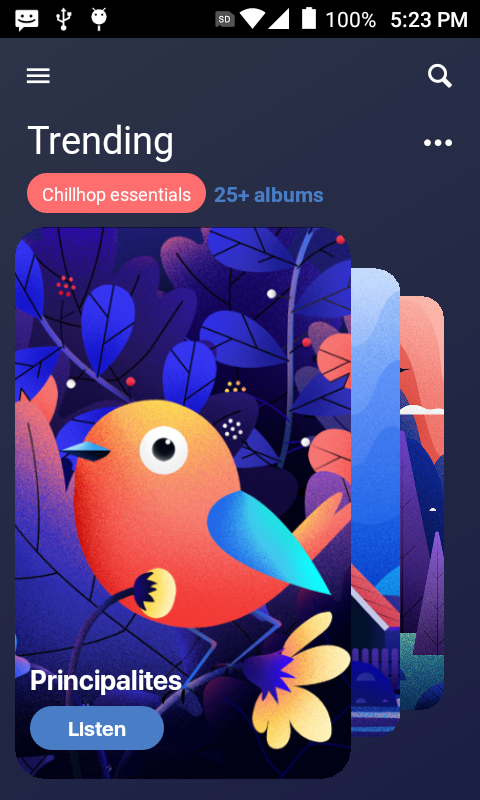
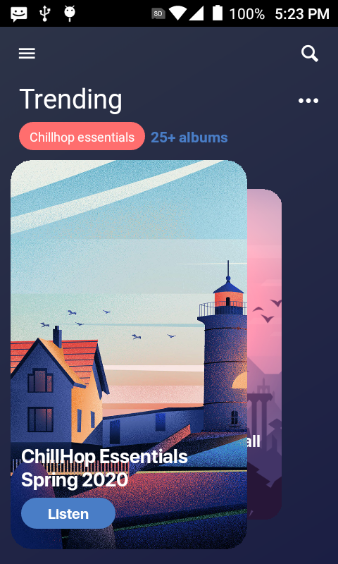

## Albums

### About
I made this animation a couple months ago before commiting to this repository, it was inspired by a flutter video about this same challenge but i could not find it

### Techniques used
- Fling (Swipe) gesture provided by awersome RNGH2

### Observations
- Flatlist items that require position absolute are REALLY out of the bounds of its parent container
- zIndex property does not work in Android, in order to get all items stack up in the correct order the collection must be reversed

### Showcase

https://user-images.githubusercontent.com/52082794/157982890-bf5a8287-baac-4f74-8d0a-1fafbf52c0be.mp4