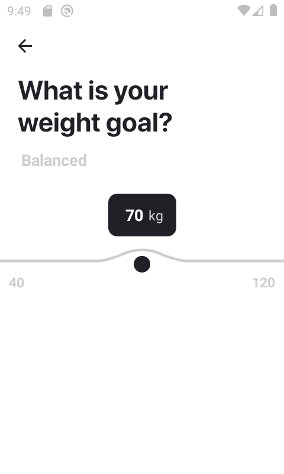

## Bezier slider

### About
This small project is based on this awesome [dribble shot](https://dribbble.com/shots/4833779-UI-Motion-kit), i could not do it myself without the help of these 2 awesome videos [Liquid swipe](https://www.youtube.com/watch?v=6jxy5wfNpk0&t=266s) and [Jelly scroll](https://youtu.be/Xnj6uoW2PJM).

### Observations
- The curve made by the slider seems to be a quarter of the radius of a larger circle
- depending of which direction is the slider going, the trail get longer and the front part gets shorter to give a sense of speed, i assume it's calcuted throught deltaX / deltaTime
- I have not yet implemented the speed trial on both sides of curve, from left to right the dot matches with the curve but not the other way around, at least for now

### Techniques
- Bezier curves with svg throught the `C` command
- PanGestureHandler
- Some game dev math to calculate the direction and speed

### Showcase

