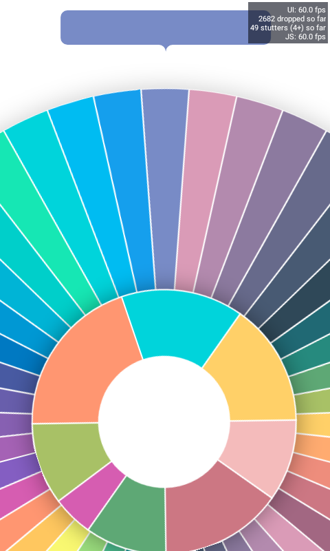
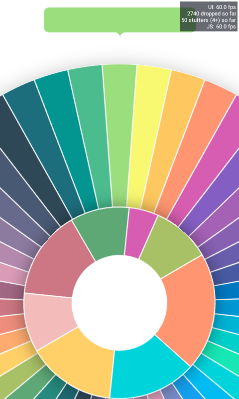

## Rotation color selection (Work in progress)

### About

Just afer giving a quick look to reddit i found myself clicking [this post](https://www.reddit.com/r/reactnative/comments/u8oz0g/how_to_create_something_like_this_in_rn/).
I felt quite fascinated how some simply trignometry can deliver such awesome user experiences, so i decided to build it myself!!!

### Techniques

- Pan gesture
- Some trigonometry

### Observations

- Svg shapes are dynamically generated by calculating the start and end point of each arc base on the angle and previous point
- Rotation angle range from `0` to `2Pi` to allow a nice color interpolation indicator
- Circle rotation is calculated by first defining which angle user's first toouch is, by using `x` and `y` values (not `translationX` and `translationY`), this first calculated angle is considered to be the origin of the rotation, with the "origin" defined, as the user moves their fingers around the current angle is recalculated, so the difference between the origin and the current angle it's added to rotation offset, then it's normalized to range from `0` to `2Pi` like this:
  `(offset + (newAngle - origin) + 2Pi) % 2Pi` (as angles can be negative, `+2Pi` is added, if the angle is positive it gets cancelled by `% 2Pi`)
- Android seems to be perform quite badly at rendering huge and multiple svg shapes

### Trigonometry alternative

The benefits of trigonometry out weight any other kind of implementation, but it's possible to replicate some of this behaivour by using using `trasnlateX`, you can define the max lenght as `2Pi * R`, and interpolate `trasnlateX` as you move around to get the proper angle.

```javascript
interpolate(translateX, [0, maxLength], [0, 2 * Math.PI]);
```

A similar behaviour can be seen on[ William Candillon's BBC player video](https://www.youtube.com/watch?v=zF9rmPH00AA&t=418s)

### Perfomance issues

- Reanimated 2's `interpolateColor` function reduces framerate by up to 31 fps
- React native svg destroy's performance in Js thread

In order to solve these problems I moved from svg to [react-native-skia](https://shopify.github.io) as it keeps 60 fps on both threads, to replace `interpolateColor` function i had to make
an "svg mask"

### Showcase

[]("")


> **WARNING :warning:**: I own a very low end phone and laptop both of them suffer heavily when recording, when not recording this animation runs at 60 fps no problem

https://user-images.githubusercontent.com/52082794/165546297-f9102197-0d76-4207-ae82-804c68c42728.mp4
