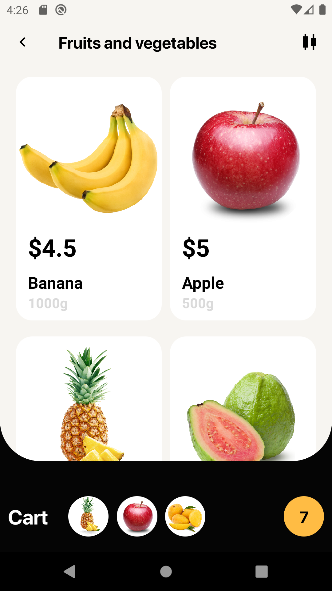
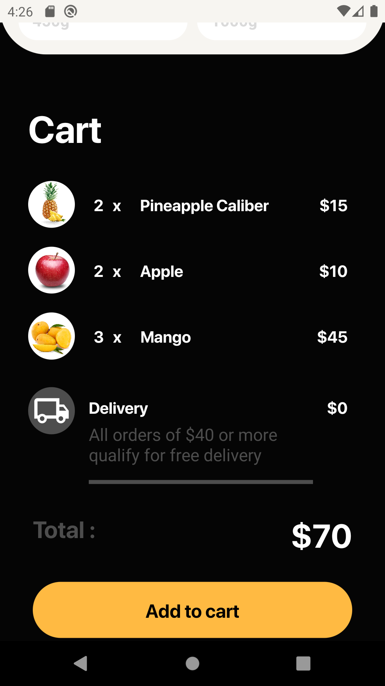
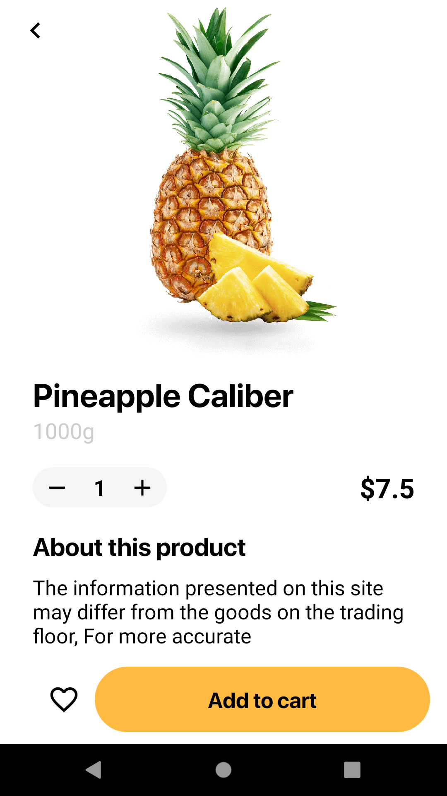

## Grocery store

### About
This small project is based on this [dribble shot](https://dribbble.com/shots/9876208-Grocery-store-concept-shopping-app) of a really cool grocery store

### Techniques used
- Shared element transitions provided by awesome wix react-native-navigation
- FlingGestureHandler with Reanimated 2 aka swipe gesture

### Showcase
> **WARNING :warning:**: Recorded footage is not an accurate representation of how the app actually behaves, performance is better when not recording and colors are brighter.

