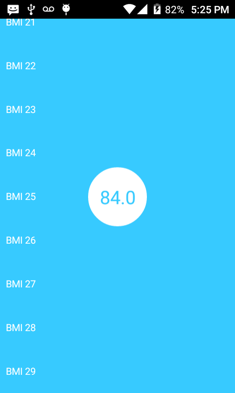
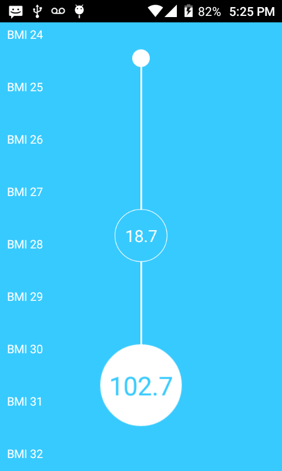
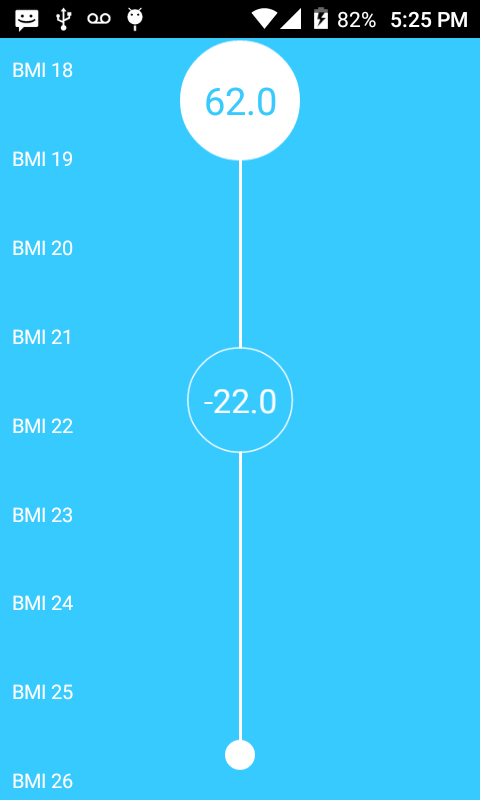

## WiThings HealthMate

### About
This is animation it's my implementation of an old [William candillon's video](https://www.youtube.com/watch?v=AZPc-aeYkSY&t=478s), i foudn the idea interesting although i didn't watch it as i wanted to implement it by myself.

### Observations
- Flatlist's contentOffset props do not seems to work at all
- Flatlist's initialScrollIndex does not preserves that index as an scroll offset

### Techniques
- Pan gesture handlers
- High order animations
- ForwardRef? Idk

### Showcase

https://user-images.githubusercontent.com/52082794/161643023-5506cdd6-1300-4578-af5c-9606b53b2cae.mp4