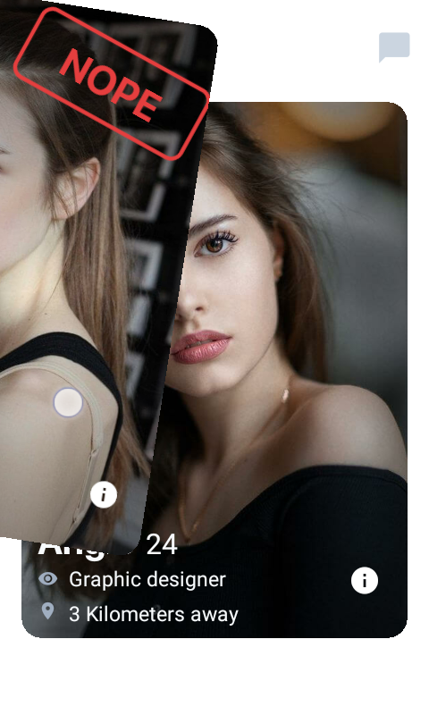
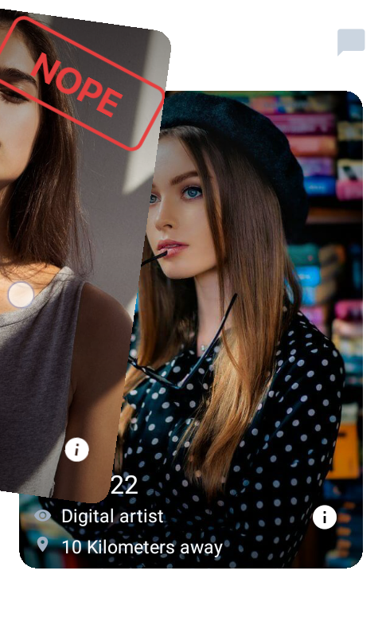

## Tinder

### About
Tinder swipe is quite interesting as the x and y coordinates determines not only the angle rotation is made but the direction of this one.

### Observations
- X coordinate controls the angle
- Y coordinate controls wether is angle is positive or not, in other words it controls its direction in a range from -1 to 1
- Shopify's skia performance kinda sucks on low end devices

### Techniques
- Pan gesture handler provided by awesome RNGH2
- Basic trigonometry to determine the rotated card width
- Snap points

### Showcase

https://user-images.githubusercontent.com/52082794/159377883-a458aebd-6e7e-417e-8dbf-04f605301845.mp4